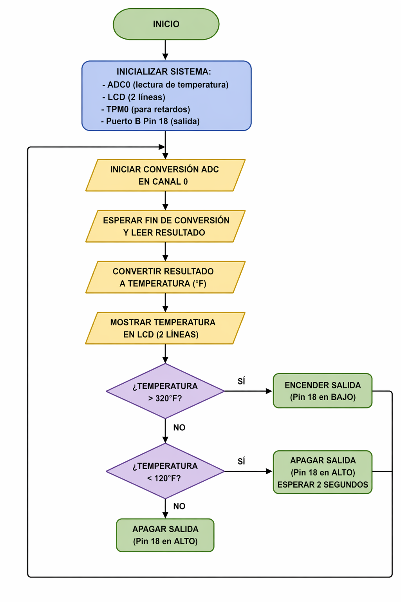

# SoC Practice: Temperature Measurement and Control System  
## Andre - Santi - Jared - Joshua  

This project consists of the design and implementation of an embedded system capable of measuring temperature using an analog sensor and displaying the result on an LCD screen. Additionally, the system performs basic control logic based on temperature thresholds to activate or deactivate an output pin.

---

## Materials Used

To replicate this project, the following hardware is required:

* **Development Board:** NXP FRDM-KL25Z  
* **Sensor:** LM34 Analog Temperature Sensor (10 mV/°F)  
* **Display:** Alphanumeric LCD (16x2) operating in **8-bit mode**  
* **Output:** Digital output (LED or actuator connected to PTB18)  
* **Extra Components:** Breadboard, jumper wires  

---

## System Features

* **Temperature Acquisition:** Uses the ADC0 module in 16-bit mode with hardware averaging (32 samples) for improved precision.  
* **Real-Time Display:** The measured temperature is continuously updated on an LCD.  
* **Analog to Digital Conversion:** Converts LM34 voltage output into temperature in Fahrenheit.  
* **Threshold Control:**  
  * Activates output when temperature exceeds a high limit  
  * Deactivates output when temperature drops below a low limit  
* **Timer-Based Delay:** Uses TPM0 for accurate delay generation.  

---

## Architecture and Pin Mapping

### ADC Input - Port E
* **Analog Channel:** `PTE20` (ADC0 Channel 0)  
  * Connected to LM34 output  

---

### LCD Screen - Ports A and D (8-Bit Mode)

* **Data Bus (8 bits):** `PTD0` – `PTD7`  
* **Control Pins:**
  * **RS (Register Select):** `PTA2`  
  * **R/W (Read/Write):** `PTA4`  
  * **EN (Enable):** `PTA5`  

---

### Digital Output - Port B

* **Output Pin:** `PTB18`  
  * Used as control signal (LED or actuator)  

---

### Timer Module

* **TPM0:** Used to generate delays via overflow counting  

---

## Execution Flow

1. **Initialization:**
   * Configure ADC0 for 16-bit conversion and averaging  
   * Initialize LCD in 8-bit mode  
   * Configure TPM0 timer  
   * Set PTB18 as output  

2. **Main Loop:**
   * Start ADC conversion on channel 0  
   * Wait for conversion to complete  
   * Read ADC result  

3. **Data Processing:**
   * Convert ADC value to temperature:
     ```
     Temperature = (ADC_result × 330) / 65536
     ```

4. **Display:**
   * Clear LCD  
   * Print `"Temperatura:"` on first line  
   * Print temperature value on second line  

5. **Control Logic:**
   * If temperature > 320°F → activate output (PTB18 LOW)  
   * If temperature < 120°F → deactivate output and wait 2 seconds  
   * Otherwise → keep output OFF  

6. **Repeat indefinitely**

---

## System Flowchart

Below is the flowchart illustrating the system behavior:



---

## Notes and Considerations

* The LM34 sensor outputs **10 mV per °F**, simplifying conversion.  
* ADC reference voltage is **3.3V**, which defines the scaling factor.  
* Floating-point operations are minimized for embedded efficiency.  
* Continuous LCD clearing may cause flickering (can be optimized).  

---

## Possible Improvements

* Add temperature display in **Celsius (°C)**  
* Implement **interrupt-driven ADC** instead of polling  
* Optimize LCD refresh (update only changed characters)  
* Add filtering or smoothing techniques  
* Include visual or sound alarms (LED/Buzzer)  
