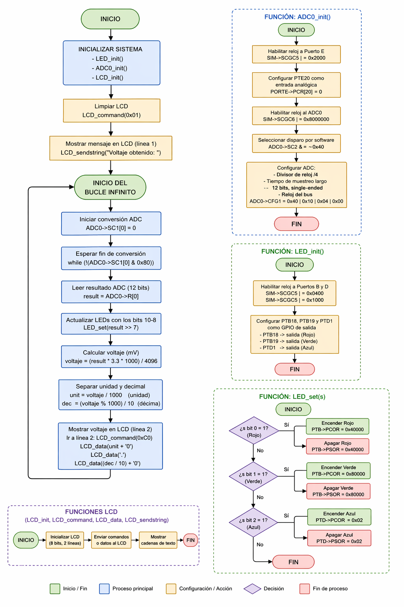

# SoC Practice: ADC Voltage Visualization with RGB LED and LCD  
## Andre - Santi - Jared - Joshua  

This project implements an embedded system that reads an analog voltage using a potentiometer, displays the measured voltage on an LCD screen, and simultaneously controls an RGB LED based on the ADC result. The system demonstrates real-time analog-to-digital conversion and visualization.

---

## Materials Used

To replicate this project, the following hardware is required:

* **Development Board:** NXP FRDM-KL25Z  
* **Input:** Potentiometer (connected between 3.3V and GND)  
* **Display:** Alphanumeric LCD (16x2) operating in **8-bit mode**  
* **Output:** RGB LED (onboard LED of FRDM-KL25Z)  
* **Extra Components:** Breadboard, jumper wires  

---

## System Features

* **Analog Input Reading:** Uses ADC0 to continuously read voltage from a potentiometer.  
* **Real-Time Visualization:** Displays the measured voltage directly on an LCD screen.  
* **RGB LED Control:** Uses ADC result bits to dynamically change LED color.  
* **Efficient Conversion:** Converts ADC value into millivolts and formats it manually (without `sprintf`).  
* **Continuous Operation:** System runs in an infinite loop updating values in real time.  

---

## Architecture and Pin Mapping

### ADC Input - Port E
* **Analog Channel:** `PTE20` (ADC0 Channel 0)  
  * Connected to potentiometer (voltage divider between 3.3V and GND)  

---

### LCD Screen - Ports A and D (8-Bit Mode)

* **Data Bus (8 bits):** `PTD0` – `PTD7`  
* **Control Pins:**
  * **RS (Register Select):** `PTA2`  
  * **R/W (Read/Write):** `PTA4`  
  * **EN (Enable):** `PTA5`  

---

### RGB LED - Ports B and D

* **Red:** `PTB18`  
* **Green:** `PTB19`  
* **Blue:** `PTD1`  

> Note: LEDs operate with **inverse logic** (LOW = ON, HIGH = OFF).

---

## Execution Flow

1. **Initialization:**
   * Configure RGB LED pins as outputs  
   * Initialize ADC0 for 12-bit conversion  
   * Initialize LCD in 8-bit mode  
   * Display initial message: `"Voltaje obtenido:"`  

2. **Main Loop:**
   * Start ADC conversion on channel 0  
   * Wait until conversion is complete  
   * Read ADC result  

3. **LED Control:**
   * Use bits 10–8 of ADC result:
     ```
     LED_set(result >> 7)
     ```
   * This changes the RGB LED color dynamically  

4. **Data Processing:**
   * Convert ADC value to voltage in millivolts:
     ```
     voltaje = (result × 3.3 × 1000) / 4096
     ```
   * Extract integer and decimal parts:
     ```
     unit = voltaje / 1000
     dec = (voltaje % 1000) / 10
     ```

5. **Display:**
   * Move cursor to second line  
   * Show voltage in format:
     ```
     X.Y
     ```
   * Example:
     ```
     2.45
     ```

6. **Repeat indefinitely**

---

## System Behavior

* Rotating the potentiometer changes the input voltage  
* The LCD updates to reflect the new voltage value  
* The RGB LED changes color depending on the ADC value range  

---

## System Flowchart

Below is the flowchart illustrating the system behavior:



---

## Notes and Considerations

* ADC resolution is **12 bits (0–4095)**  
* Reference voltage is **3.3V**  
* Voltage is displayed with **1 decimal precision**  
* Manual formatting avoids using `sprintf`, improving efficiency  
* LED color is determined by shifting ADC result bits  

---

## Possible Improvements

* Display voltage with higher precision (2 or 3 decimals)  
* Add voltage units (`V`) to LCD output  
* Implement smoothing/filtering for stable readings  
* Use interrupts instead of polling for ADC  
* Map LED colors more intuitively to voltage ranges  

---
