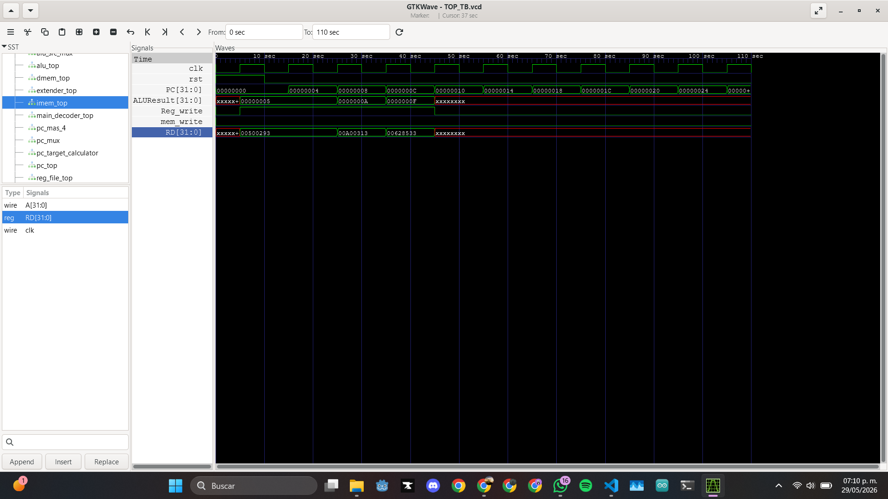
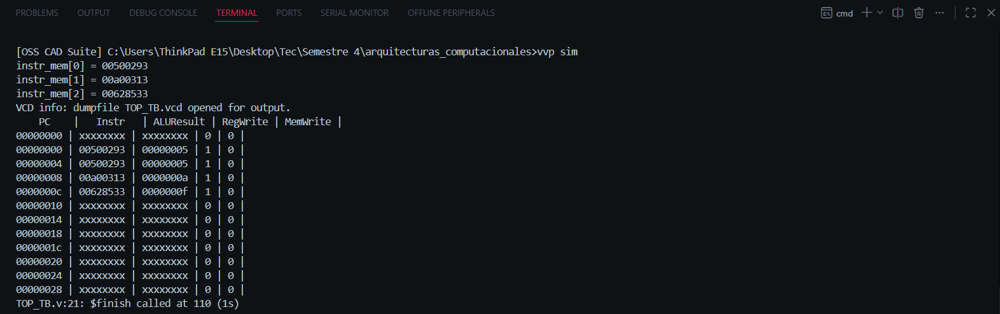

# Single-Cycle RISC-V Processor

## Jared Rafael García Almaguer

This project consists of the design and simulation of a **single-cycle RISC-V processor** implemented in Verilog/SystemVerilog. The processor was built using independent hardware modules connected through a top-level datapath. The design supports a basic subset of RISC-V instructions, including arithmetic, memory access, branch, and jump operations.

The main objective of this project is to understand how a single-cycle CPU executes one instruction per clock cycle by combining the program counter, instruction memory, register file, immediate extender, control unit, ALU, data memory, and multiplexers into one complete datapath.

---

## Project Description

The processor follows the structure of a simplified **single-cycle RISC-V datapath**. In this architecture, each instruction is fetched, decoded, executed, and completed within one clock cycle.

The implemented processor can execute instructions such as:

* **R-type instructions:** `add`, `sub`, `and`, `or`, `slt`
* **I-type instructions:** `addi`, `lw`
* **S-type instructions:** `sw`
* **B-type instructions:** `beq`
* **J-type instructions:** `jal`

The project includes a testbench that loads machine code instructions from a `.hex` file and verifies the behavior of the processor through simulation.

---

## Files Included

The project is organized into the following Verilog/SystemVerilog modules:

| File                    | Description                                                                                 |
| ----------------------- | ------------------------------------------------------------------------------------------- |
| `TOP.v`                 | Top-level module that connects the complete datapath.                                       |
| `PROGRAM_COUNTER.v`     | Stores the current instruction address and updates the PC every clock cycle.                |
| `instruction_memory.sv` | Stores and provides the instruction to be executed.                                         |
| `REG_FILE.v`            | Register file with 32 registers of 32 bits.                                                 |
| `MAIN_DECODER.v`        | Main control unit that generates control signals based on the instruction opcode.           |
| `ALU_DECODER.v`         | Generates the ALU control signal using `ALUOp`, `funct3`, `funct7`, and opcode information. |
| `ALU.v`                 | Performs arithmetic and logic operations.                                                   |
| `EXTENDER.v`            | Generates sign-extended immediate values for I, S, B, and J-type instructions.              |
| `DATA_MEM.v`            | Data memory used by load and store instructions.                                            |
| `MUX.v`                 | 4-to-1 multiplexer used in different parts of the datapath.                                 |
| `SUMADOR.v`             | 32-bit adder used for PC + 4 and branch/jump target calculations.                           |
| `TOP_TB.v`              | Testbench used to simulate the processor.                                                   |
| `instrMem.hex`          | Instruction memory initialization file.                                                     |

---

## Module Descriptions

### `TOP.v`

The `TOP` module is the main module of the processor. It connects all the components of the datapath, including the program counter, instruction memory, register file, control unit, ALU, data memory, immediate extender, adders, and multiplexers.

Its main function is to coordinate the flow of data and control signals required to execute each instruction.

Main internal signals include:

* `PC`: current program counter value.
* `PC_next`: next PC value.
* `instr`: current instruction.
* `RD1`, `RD2`: data read from the register file.
* `imm_ext`: sign-extended immediate.
* `ALUResult`: result generated by the ALU.
* `read_data`: data read from data memory.
* `result`: final value written back to the register file.
* `PCSrc`, `ResultSrc`, `MemWrite`, `ALUSrc`, `RegWrite`: control signals.

---

### `PROGRAM_COUNTER.v`

The program counter stores the address of the current instruction. On reset, it is initialized to `0`. On each positive clock edge, it updates its value with `PC_next`.

This module allows the processor to advance through the instruction memory or jump to a branch/jump target address.

---

### `instruction_memory.sv`

The instruction memory stores the machine code instructions that the processor executes. The instructions are loaded from the file:

```text
instrMem.hex
```

The memory uses the program counter value to select the instruction. Since RISC-V instructions are 32 bits wide, the address is indexed using word addressing.

Example loaded instructions:

```text
00500293
00a00313
00628533
```

These instructions correspond to:

```asm
addi x5, x0, 5
addi x6, x0, 10
add  x10, x5, x6
```

---

### `REG_FILE.v`

The register file contains 32 registers of 32 bits each. It has two read ports and one write port.

Features:

* Reads two registers using `rs1` and `rs2`.
* Writes to register `rd` when `write_enable` is active.
* Register `x0` always returns zero.
* Register `x0` cannot be overwritten.

This module is essential for RISC-V instruction execution because most instructions read from and write to registers.

---

### `MAIN_DECODER.v`

The main decoder receives the opcode of the instruction and generates the main control signals for the datapath.

Generated control signals include:

* `PC_src`
* `Result_src`
* `mem_write`
* `ALU_src`
* `Reg_write`
* `branch`
* `ALU_op`
* `imm_src`

The decoder supports the following instruction formats:

| Opcode    | Instruction Type | Description                              |
| --------- | ---------------- | ---------------------------------------- |
| `0000011` | I-type           | Load word (`lw`)                         |
| `0010011` | I-type           | Arithmetic immediate (`addi`)            |
| `0100011` | S-type           | Store word (`sw`)                        |
| `0110011` | R-type           | Register arithmetic/logical instructions |
| `1100011` | B-type           | Branch instruction (`beq`)               |
| `1101111` | J-type           | Jump instruction (`jal`)                 |

---

### `ALU_DECODER.v`

The ALU decoder generates the specific ALU operation based on:

* `ALUOp`
* `funct3`
* `funct7`
* `op5`

This module allows the processor to distinguish between arithmetic and logical instructions such as:

* `add`
* `sub`
* `and`
* `or`
* `slt`

The generated `ALUControl` signal is sent to the ALU.

---

### `ALU.v`

The ALU performs arithmetic and logic operations between two 32-bit inputs, `A` and `B`.

Supported operations:

| ALUControl | Operation     |
| ---------- | ------------- |
| `000`      | Addition      |
| `001`      | Subtraction   |
| `010`      | AND           |
| `011`      | OR            |
| `101`      | Set Less Than |

The ALU also generates the `Zero` flag, which is used for branch decisions.

---

### `EXTENDER.v`

The extender generates the immediate value required by different instruction formats. It receives the full 32-bit instruction and the `imm_src` control signal.

Supported immediate formats:

* I-type immediate
* S-type immediate
* B-type immediate
* J-type immediate

The output is a 32-bit sign-extended immediate value.

---

### `DATA_MEM.v`

The data memory is used for load and store instructions.

Features:

* Stores 32-bit words.
* Writes data on the positive clock edge when `WE` is active.
* Reads data using word-addressed memory.
* Initializes memory values to zero at the beginning of the simulation.

This module allows the processor to execute instructions such as `lw` and `sw`.

---

### `MUX.v`

The multiplexer module is a 4-to-1 selector used in multiple parts of the datapath.

It is used for:

* Selecting the second ALU operand.
* Selecting the next PC value.
* Selecting the value written back to the register file.

Inputs:

* `in0`
* `in1`
* `in2`
* `in3`

The output depends on the 2-bit `select` signal.

---

### `SUMADOR.v`

The adder module performs 32-bit addition. It is used mainly for:

* Calculating `PC + 4`.
* Calculating branch and jump target addresses.

---

### `TOP_TB.v`

The testbench simulates the processor by generating the clock and reset signals. It also creates a `.vcd` waveform file for visualization.

The simulation displays key internal signals such as:

* `PC`
* `Instr`
* `ALUResult`
* `RegWrite`
* `MemWrite`

These signals are useful to verify whether the processor is executing the instructions correctly.

---

## Complete Datapath Diagram

The complete datapath connects all the modules required to execute RISC-V instructions in a single cycle.

The general flow is:

1. The `PROGRAM_COUNTER` provides the current instruction address.
2. The `instruction_memory` outputs the instruction stored at that address.
3. The instruction fields are sent to the register file, immediate extender, main decoder, and ALU decoder.
4. The register file outputs source operands.
5. The ALU executes the selected operation.
6. The data memory is accessed if the instruction is `lw` or `sw`.
7. The result multiplexer selects the value to write back to the register file.
8. The next PC is selected between `PC + 4` and the branch/jump target.

### Datapath Diagram

Replace the image name with your final diagram file:


---

## RTL / Block Diagram

The RTL diagram shows the hardware modules generated by the synthesis or simulation tool.

Replace the image name with your final RTL diagram file:



---

## Simulation Evidence

The processor was tested using multiple simulation cases. Each test validates a different part of the datapath and control unit.

### Basic Arithmetic Instructions

This test verifies the execution of:

```asm
addi x5, x0, 5
addi x6, x0, 10
add  x10, x5, x6
```

Expected result:

```text
x10 = 15
```

Observed simulation behavior:

```text
Instr = 00500293 | ALUResult = 00000005
Instr = 00a00313 | ALUResult = 0000000a
Instr = 00628533 | ALUResult = 0000000f
```

This confirms that the processor correctly executes immediate addition and register addition.

Replace the image name with your simulation screenshot:



---

## Example Simulation Output

The following output shows a successful execution of the arithmetic test:

```text
instr_mem[0] = 00500293
instr_mem[1] = 00a00313
instr_mem[2] = 00628533
VCD info: dumpfile TOP_TB.vcd opened for output.
    PC    |   Instr   | ALUResult | RegWrite | MemWrite |
00000000 | 00500293 | 00000005 | 1 | 0 |
00000008 | 00a00313 | 0000000a | 1 | 0 |
0000000c | 00628533 | 0000000f | 1 | 0 |
```

The final ALU result is:

```text
0000000f
```

Which is equal to:

```text
15 decimal
```

Therefore, the arithmetic execution test was successful.

---

## How to Run the Simulation

To compile the design using Icarus Verilog:

```bash
iverilog -o sim TOP_TB.v TOP.v PROGRAM_COUNTER.v instruction_memory.sv REG_FILE.v SUMADOR.v MAIN_DECODER.v ALU_DECODER.v EXTENDER.v MUX.v ALU.v DATA_MEM.v
```

To run the simulation:

```bash
vvp sim
```

To open the waveform file:

```bash
gtkwave TOP_TB.vcd
```

Make sure the instruction memory file is named exactly:

```text
instrMem.hex
```

This is required because the instruction memory loads the program using:

```verilog
$readmemh("instrMem.hex", instr_mem);
```

---

## Results

The processor successfully executed the arithmetic test program. The instructions were fetched from instruction memory, decoded by the control unit, executed by the ALU, and the correct result was produced.

For the arithmetic test:

```asm
addi x5, x0, 5
addi x6, x0, 10
add  x10, x5, x6
```

The expected result was:

```text
x10 = 15
```

The simulation produced:

```text
ALUResult = 0000000f
```

Since `0x0000000f` is equal to `15` in decimal, the processor behavior is correct for this test.

---

## Author

**Jared Rafael García Almaguer**
